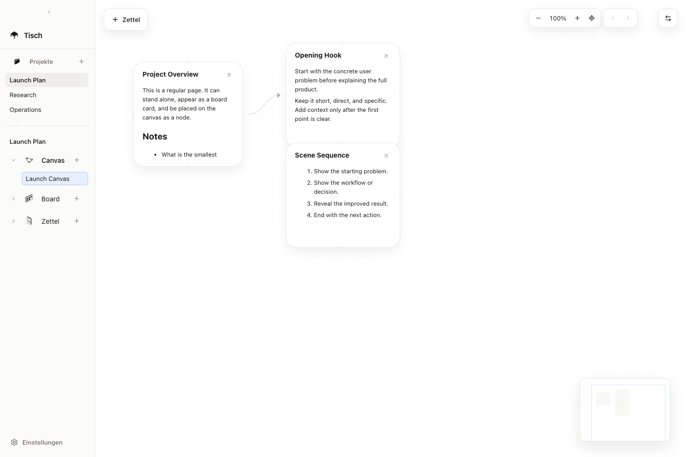
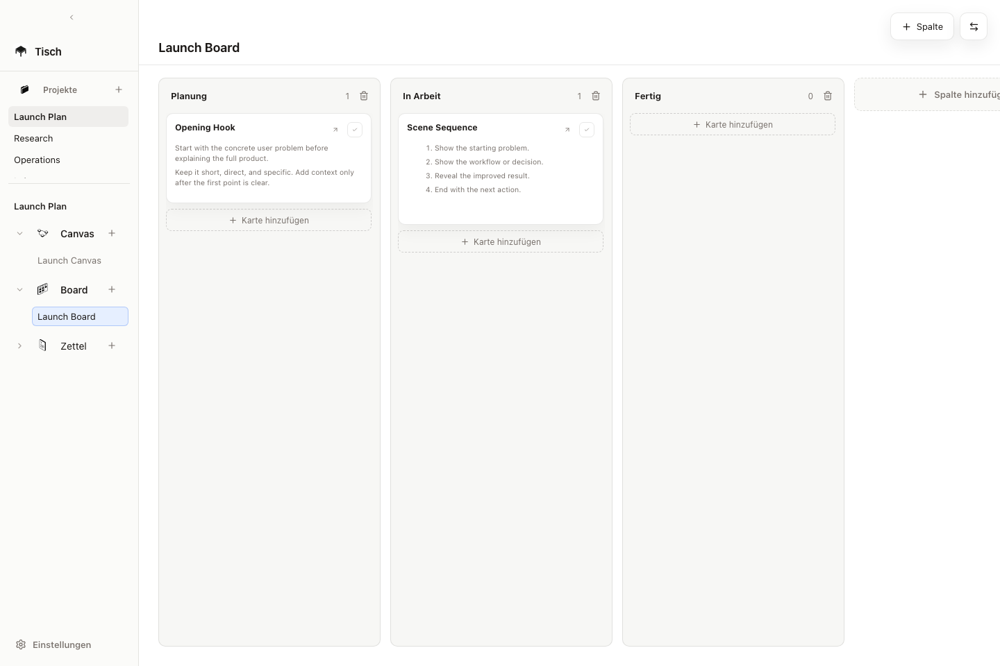
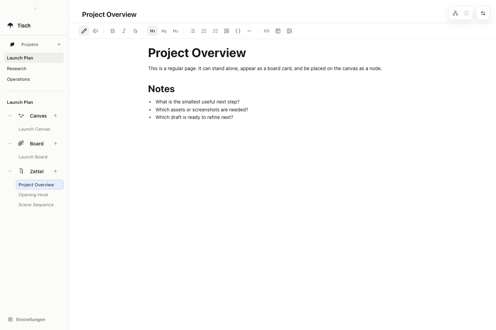

# Tisch

Tisch is a local-first desktop app for planning, writing, and arranging ideas.
The same note can appear as a Markdown page, a card on a board, and a node on a
canvas.

Tisch is not a hosted service. Your workspace data is stored on your own
machine, outside of this Git repository.

## Features

- Markdown pages for long-form notes
- Project-based sidebar with notes, boards, and canvases
- Kanban-style boards with configurable columns
- Freeform canvases with connected nodes
- Local image import for canvas/page assets
- Local CLI for agent-friendly workspace changes
- Companion Codex skill for teaching agents how to use the CLI
- Shared storage layer for the Electron app and CLI

## Screenshots







## Stack

- Electron desktop shell
- React and TypeScript UI
- Vite development/build tooling
- React Flow for canvas nodes and edges
- TipTap for Markdown editing
- Local JSON and Markdown files as the workspace format

## Requirements

- Node.js 22 or newer
- npm

## Getting Started

```bash
npm install
npm start
```

`npm start` opens the Electron app window.

Useful commands:

```bash
npm run dev
npm run build
npm run lint
npm run electron:preview
npm exec tisch -- workspace path
```

## Local Data

By default, Tisch stores user data in the operating-system app data directory:

```text
macOS:   ~/Library/Application Support/Tisch/workspace
Windows: %APPDATA%/Tisch/workspace
Linux:   ~/.config/Tisch/workspace
```

The workspace contains:

```text
workspace/
  planner.json
  pages/
    note.md
  images/
    imported-image.png
```

`planner.json` stores projects, items, boards, canvases, nodes, edges, and
links. Long note content is stored as Markdown files under `pages/`.

For development or scripted workflows, override the workspace path:

```bash
TISCH_WORKSPACE_DIR=/path/to/workspace npm exec tisch -- workspace init
PLANNER_WORKSPACE_DIR=/path/to/workspace npm start
```

`TISCH_WORKSPACE_DIR` is preferred for the CLI. `PLANNER_WORKSPACE_DIR` is kept
for development compatibility.

## CLI

The local CLI is exposed as `tisch`:

```bash
npm exec tisch -- workspace init
npm exec tisch -- project list
npm exec tisch -- project create --name "Project"
npm exec tisch -- zettel create --project "Project" --title "Idea" --body "..."
npm exec tisch -- board create --project "Project" --title "Board"
npm exec tisch -- canvas create --project "Project" --title "Canvas"
npm exec tisch -- canvas add-node --canvas "Canvas" --title "Hook" --body "..."
npm exec tisch -- canvas connect --canvas "Canvas" --from "Hook" --to "CTA"
```

Create/list commands return JSON so local automations and AI agents can reuse
IDs instead of guessing.

## Companion Skill

Tisch includes a Codex companion skill under `skills/tisch/`. The app and CLI are
the software; the skill teaches an agent how to use the CLI to create and update
projects, Zettels, boards, cards, canvases, nodes, and connections.

In Codex, ask:

```text
Install the Tisch skill from https://github.com/selamiselvi/Tisch/tree/main/skills/tisch
```

Then restart Codex and use `$tisch` in prompts. See
[docs/AGENT_SKILL.md](docs/AGENT_SKILL.md) for details.

## Architecture

The UI does not write directly to workspace files. It uses
`src/lib/plannerApi.ts`, which calls Electron IPC methods exposed by
`electron/preload.cjs`.

Electron and the CLI share the same storage implementation in
`lib/workspace-store.cjs`. This keeps app edits and CLI edits compatible.

High-level flow:

```text
React UI -> plannerApi.ts -> Electron preload IPC -> electron/main.cjs
                                            |
CLI bin/tisch.cjs --------------------------+
                                            |
                                    lib/workspace-store.cjs
                                            |
                              planner.json + pages/*.md + images/*
```

## Project Structure

```text
bin/                  CLI entry point
electron/             Electron main and preload scripts
lib/                  Shared workspace storage logic
public/               Static public assets
skills/tisch/         Companion Codex skill for agents
src/                  React app, styles, types, and seed data
```

## Development Notes

- Run `npm run lint` before opening a pull request.
- Run `npm run build` to type-check and produce the Vite build.
- Do not commit local workspace data. The `workspace/` directory is ignored.
- Do not commit generated app builds, local env files, logs, or Playwright
  output.

## License

Tisch is released under the MIT License. See [LICENSE](LICENSE).
